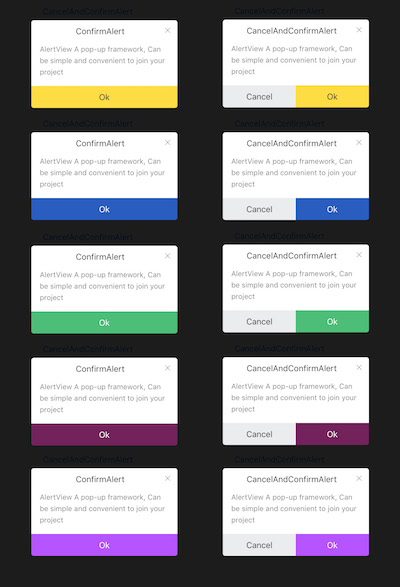

# AlertView
多样化的AlertView



RAlertView
===
AlertView A pop-up framework, Can be simple and convenient to join your project.

## Installation
- Depend on the project ` Masonry `and ` HexColors ` Import  `#import "Masonry.h"` `#import "HexColors.h"`
- Import the main header file：`#import "RAlertView.h"`

## Preview  AlertStyle
```objective-c
typedef NS_ENUM(NSInteger,AlertStyle) {
    SimpleAlert = 0,
    ConfirmAlert,
    CancelAndConfirmAlert,
};
```

## Preview  AlertTheme
```objective-c
typedef NS_ENUM(NSInteger,AlertTheme) {
    YellowAlert = 0,
    GreenAlert,
    BlueAlert,
    Purple1Alert,
    Purple2Alert,
};
```
## SimpleAlert
```objective-c
RAlertView *alert = [[RAlertView alloc] initWithStyle:SimpleAlert];
alert.contentText = @"SimpleAlert \nAlertView A pop-up framework, Can be simple and convenient to join your project";
```
## ConfirmAlert
```objective-c
RAlertView *alert = [[RAlertView alloc] initWithStyle:ConfirmAlert];
alert.theme = Purple1Alert;
alert.headerTitle = @"ConfirmAlert";
alert.contentText = @"AlertView A pop-up framework, Can be simple and convenient to join your project";
alert.confirmButtonText = @"Ok";
alert.confirmButtonBlock = ^(){
    NSLog(@"Click on the Ok");
};
```
## CancelAndConfirmAlert
```objective-c
RAlertView *alert = [[RAlertView alloc] initWithStyle:CancelAndConfirmAlert];
alert.headerTitle = @"CancelAndConfirmAlert";
alert.contentText = @"AlertView A pop-up framework, Can be simple and convenient to join your project";
alert.confirmButtonText = @"Ok";
alert.cancelButtonText = @"Cancel";
alert.confirmButtonBlock = ^(){
    NSLog(@"Click on the Ok");
};
alert.cancelWindowBlock = ^(){
    NSLog(@"Click on the Cancel");
};
```
